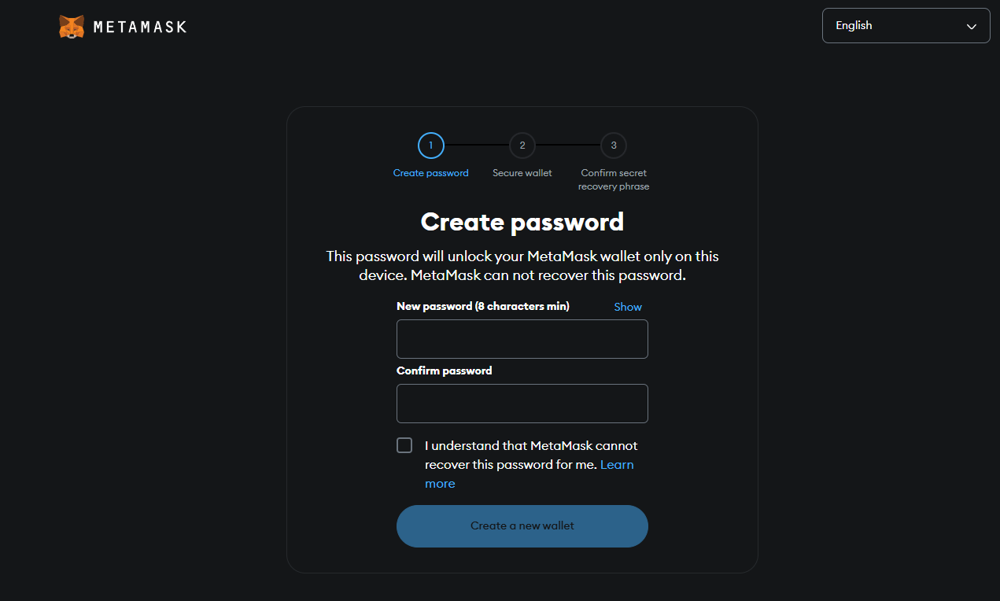
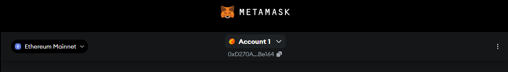
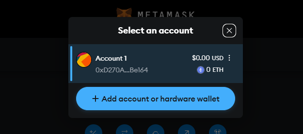
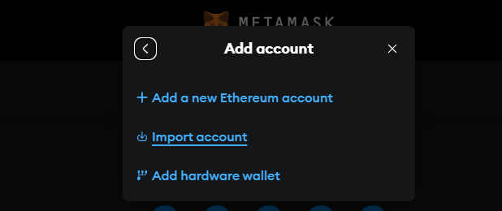
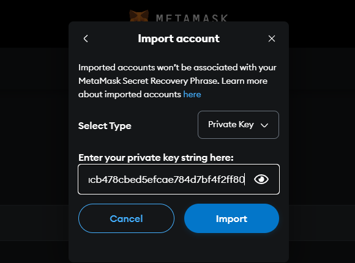

<div align="center">

# 🏗️ Smart Assembly Scaffold

> A template for creating DApps for EVE Frontier

</div>

## Table of Contents

1. [Introduction](#introduction)
2. [Development & Deployment Steps in Local Environment](#️-development--deployment-steps-in-local-environment)
3. [Development & Deployment Steps for the Game (Stillness)](#️-development--deployment-steps-for-the-game-stillness)
4. [Troubleshooting](#troubleshooting)

## Introduction

EVE Frontier Smart Assembly Scaffold is a streamlined framework designed for interfacing with the EVE Frontier game. It provides:

- **Blockchain Primitives**: Access to basic smart assembly information and ownership details
- **MUD Integration**: Built on MUD framework for efficient blockchain state management
- **Modern Tech Stack**: Utilizes React, Rainbowkit, TypeScript, Tailwind CSS, and Vite
- **Contract Management**: Uses the `example` MUD namespace for simplified contract interactions

### 🚀 User Flow

The Smart Assembly Scaffold provides a minimal example to toggle the state of an item on or off.

---

## 🛠️ Development & Deployment Steps in Local Environment

### Step 1: 🛠️ Setup your Local MetaMask Wallet

The local environment uses MetaMask as the wallet as it allows for private key import.

1. Install MetaMask through: https://metamask.io/download/
2. Open the extension and create a new wallet:



3. Select the account dropdown in the top center:



4. Select `Add account or hardware wallet`:



5. Select `Import account`:



6. Import the default private key `0xac0974bec39a17e36ba4a6b4d238ff944bacb478cbed5efcae784d7bf4f2ff80`:



You should now see the account in your wallet, and be able to use it to interact with the local environment.

### Step 2: 🏗️ Deploy Anvil, Contracts, and World Explorer

Navigate to the project’s root directory with:

```bash
cd smart-assembly-scaffold
```

Install the dependencies with:

```bash
pnpm install
```

From the project’s root directory, run:

```bash
pnpm run dev
```

This command will:

- **Fork a Docker instance of Anvil**: This creates a local blockchain environment.
- **Run a Local Instance of the World Explorer**: Enables you to visually inspect and debug the game state.
- **Deploy Contracts to the Existing Docker World**: Deploys your contracts to the local environment so you can begin interacting with them immediately.

You can then open the DApp through: http://localhost:3000

### Step 3: 🔭 Develop Against the World Explorer

You can use the World Explorer, a GUI tool for visualizing and inspecting and manipulating the state of your deployed world, by visiting:

http://localhost:13690/anvil/worlds/0x8a791620dd6260079bf849dc5567adc3f2fdc318/explore

With the World Explorer, you can interactively view tables, query on-chain data, and better understand how your smart contracts and front-end components work together in real time.

## 🛠️ Development & Deployment Steps for the Game (Stillness)

### Step 1: 🏗️ Contracts Deployment

When the contracts are ready to be deployed beyond the local environment:

Navigate to the contracts directory with:

```bash
cd packages/contracts
```

Then, if you haven't already copy the .envsample file to a .env file with:
```bash
cp .envsample .env
```

#### Environment

Next, set the following values in the [.env](./packages/contracts/.env) file to direct the scripts to use Stillness:

```bash copy
WORLD_ADDRESS=0x7fe660995b0c59b6975d5d59973e2668af6bb9c5
RPC_URL=https://garnet-rpc.live.tech.evefrontier.com
CHAIN_ID=17069
```

You can also automatically point to Stillness with current values using: 

```bash
pnpm env-stillness
```

---

#### Private Key

Import your game wallet recovery phrase into EVE Wallet to get your private key:

<div align="center">

</div>

<br />

Then, set the `PRIVATE_KEY` in your .env file:

```bash
PRIVATE_KEY=0xac0974bec39a17e36ba4a6b4d238ff944bacb478cbed5efcae784d7bf4f2ff80
```

You can also use the below command and then input your private key to change it:

```bash
pnpm set-key
```

---

#### Namespace

A namespace is a unique identifier for deploying your smart contracts. Once you deploy to a namespace, it will set you as the owner and only you will be able to deploy smart contracts within the namespace.

**Namespace Rules:**
- ✅ Use letters (a-z, A-Z)
- ✅ Use numbers (0-9)
- ✅ Use underscores (_)
- ✅ Under Max Length (Max 14 characters)
- ❌ No special characters
- ❌ No spaces

Change the namespace from `exampleName` to your own custom namespace. 

> 💡 **Tip** Consider using your username or coporation name as your namespace.

First, edit **packages/contracts/mud.config.ts** to include your new namespace:

```ts
import { defineWorld } from "@latticexyz/world";

export default defineWorld({
    namespace: "new_namespace",
    tables: {
        ...
```

Then, edit **packages/contracts/src/systems/constants.sol**:

```solidity
bytes14 constant DEPLOYMENT_NAMESPACE = "new_namespace";
```

You can also use the below command and then input your new namespace to change it automatically:

```bash
pnpm set-namespace
```

---

#### Deploy Contracts

Deploy to Stillness with:

```bash
pnpm deploy:garnet
```

**Environment Variables**:

- Ensure that your `.env` files in `packages/contracts` and `packages/client` point to the correct deployed instances. For Garnet, the `WORLD_ADDRESS` and related RPC endpoints must match the environment you are deploying to.

### Step 2: 🌐 dApp Environment Variables and Considerations

The Smart Assembly Scaffold’s client UI (dApp) leverages a `<SmartObjectContext>` to provide read-only blockchain primitives, such as smart assembly info. These primitives require access to a deployed world instance and a corresponding World API service to function correctly. This typically means working against an environment like Nova or Stillness, where dedicated API HTTP and WebSocket endpoints are available.

By connecting to these endpoints, the dApp can stream real-time updates over WebSockets, enabling dynamic state changes and real-time feedback within your dApp. To fully realize this functionality, you’ll need properly configured environment variables that point to a running instance of the World API service.

### Step 3: 💻 Configuring dApp Environment Variables

1. Navigate to the client directory with:

   ```bash
   cd packages/client
   ```

2. Copy the `.envsample` file in `./packages/client/` to `.env` if you haven't already:

   ```bash
   cp .envsample .env
   ```

3. Update the following environment variables in `./packages/client/.env`:
   - **`VITE_SMARTASSEMBLY_ID`**: The ID obtained from your deployed smart assembly in-game.
   - **`VITE_CHAIN_ID`**: The chain ID that the World uses, which for Stillness is **17069**.

### Step 4: Updating Namespace Client References

> 💡 **Tip** If you have already used the command `pnpm set-namespace` in the contracts step then you can skip this step.

To update the namespace client references, you need to search and replace the namespace in the client code. You can do this through:

1. In your IDE, for example Visual Studio Code, press Ctrl+Shift+H and search for `exampleNamesp`.

2. Include `smart-assembly-scaffold/packages/client/src` in the search.

3. Set it to replace all occurrences with your new namespace.

4. Press Ctrl+Alt+Enter to replace in files.

---

<details>
<summary><b>You can also replace each entry manually by:</b></summary>

#### Step 4.1: [smart-assembly-scaffold/packages/client/src/components/Toggle.tsx](smart-assembly-scaffold/packages/client/src/components/Toggle.tsx)

Line 19:

```tsx
table: mudConfig.namespaces.YOUR_NAMESPACE.tables.ToggleTable,
```

#### Step 4.2: [smart-assembly-scaffold/packages/client/src/components/systemCalls/handleToggle.ts](smart-assembly-scaffold/packages/client/src/components/systemCalls/handleToggle.ts)

Line 13:

```ts
txHash = await worldContract.write.YOUR_NAMESPACE__setTrue([smartObjectId]);
```

Line 15:

```ts
txHash = await worldContract.write.YOUR_NAMESPACE__setFalse([smartObjectId]);
```

</details>

---

You can also use the below command to automatically update the namespace client references:

```bash
pnpm set-namespace
```

### Step 5: 💡 Running the dApp

To run the dApp, navigate to the client directory and run:

```bash
pnpm dev
```

You can view the dApp at `localhost:3000`. Make sure your wallet is connected to the Garnet chain to fully interact with the deployed contracts.

---

## 🖥️ dApp Overview

The dApp leverages MUD tooling (`@latticexyz`) and Eveworld tooling (`@eveworld`) to integrate with EVE Frontier’s in-game systems. The UI dynamically updates as on-chain data changes, providing an immersive and real-time experience.

With the environment variables set correctly and the right blockchain gateway URLs in place, you’ll be able to toggle states, inspect game entities, and interact directly with the contracts deployed via your chosen environment.

The dApp uses Stash and the `useRecord` hook to fetch table data from your deployed contracts. Additionally, the World Explorer UI can be accessed to visually inspect states and updates in real time, streamlining your development and debugging workflows.

## Troubleshooting

If you encounter any issues, refer to the troubleshooting tips below:

1. **World Address Mismatch**: Double-check that the `WORLD_ADDRESS` is correctly updated in the `contracts/.env` file. Make sure you are deploying contracts to the correct world.
   
2. **Anvil Instance Conflicts**: Ensure there is only one running instance of Anvil. The active instance should be initiated via the `docker compose up -d` command. Multiple instances of Anvil may cause unexpected behavior or deployment errors.

3. **Not able to jump even though it's the correct corp**: Ensure you have set the correct corp ID set in the `contracts/.env` file.  

### Still having issues?
If you are still having issues, then visit [the documentation website](https://docs.evefrontier.com/Troubleshooting) for more general troubleshooting tips.