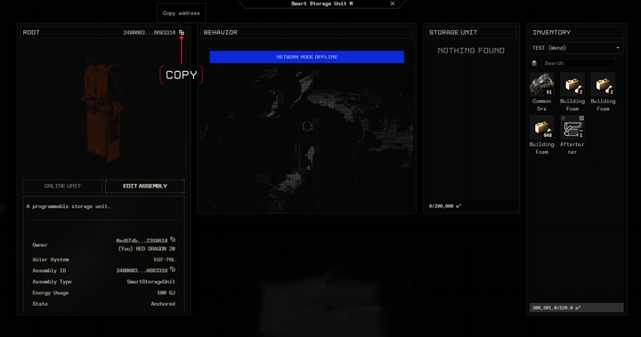

<div align="center">

# 🎯 Smart Turret Example

> Configure a [Smart Turret](https://docs.evefrontier.com/SmartAssemblies/SmartTurret) with a custom strategy

</div>

## Table of Contents

1. [Introduction](#introduction)
2. [Deployment and Testing in Local Environment](#deployment-and-testing-in-local-environment)
3. [Deployment To The Game (Stillness)](#deployment-to-the-game-stillness)
4. [Configuring and Testing the Game Contracts (Stillness)](#configuring-and-testing-the-game-contracts-stillness)
5. [Troubleshooting](#troubleshooting)

## Introduction

This example will show you how to deploy and configure smart contracts for a [Smart Turret](https://docs.evefrontier.com/SmartAssemblies/SmartTurret) with a custom strategy [Custom Strategy](#example-behavior-explanation)

Before starting make sure you've installed all required tools from the main [README](../README.md)

You can test everything locally first using the [Local Environment Guide](#deployment-and-testing-in-local-environment), and when ready, deploy to the live game using the [Deployment Guide](#deployment-to-the-game-stillness).

### Additional Information

For additional details on the Smart Turret, see our [Documentation](https://docs.evefrontier.com/SmartAssemblies/SmartTurret).

### Example Behavior Explanation

This example alters the Smart Turret to have two specific behaviors:

1. It does not shoot at anyone in the specified tribe.
   
2. It prioritizes shooting ships that have the lowest percentage of health. This is done as a strategy, as it means that ships can be destroyed faster. A byproduct of this, is that groups of Smart Turrets will share targets if in range when several are used with this example. 

> [!NOTE]
> **Technical Note:** The game processes targets in reverse array order from calling the inProximity function. While the weight value is used for sorting, it's not currently used in-game targeting logic.

## Deployment and Testing in Local Environment
To deploy the example to your local world hosted on Docker, follow the below steps.

### Step 1: Deploy the example contracts to the existing world
First, copy the World Contract Address from the Docker logs obtained in the previous step, then run the following commands:


Then, run the following commands:

1. Navigate to the example directory:
    ```bash
    cd smart-turret
    ```

2. Install the Solidity dependencies for the contracts:
    ```bash
    pnpm install
    ```

3. Create your environment file:
    ```bash
    cp packages/contracts/.envsample packages/contracts/.env
    ```

4. Deploy to your local test environment
    ```bash
    pnpm dev
    ```

> [!NOTE]
> This will deploy the contracts to a forked version of your local world for testing.

Once the contracts have been deployed you should see the below message. When changing the contracts it will automatically re-deploy them.

<div align="center">

</div>

### Step 1: Mock data for the existing world **(Local Development Only)**

Generate the test data by:

1. Select the "shell" process and then click on the main terminal window. 


2. To generate mock data for testing the Smart Turret logic on the local world, run the following command. This generates and deploys the smart turret deployable and items.

```bash
pnpm mock-data
```

> [!NOTE]
> This will create the on-chain turret, fuel it, bring it online, and create a test smart character.

### Step 2: Configure Smart Turret
To set the smart turret ID, and allowed tribe ID use:

```bash
pnpm configure
```

> [!NOTE]
> You can adjust the values of the Smart Turret ID and allowed tribe ID in the .env file as needed, though they are optional.

### Step 3: Test The Smart Turret (Optional)
To test the custom Smart Turret functionality you can use the follow command:

```bash
pnpm execute
```

You can also test the smart turret using the unit tests with:
```bash
pnpm test
```

This will run a series of pre-defined tests, and should display the results like:
![../readme-imgs/tests-turret.png]

## Deployment To The Game (Stillness)</a>
To deploy the example to the game server which is named Stillness, follow the below steps.

### Step 1: Setup your Environment
Move to the example directory with:

```bash
cd smart-turret/packages/contracts
```

Then install the Solidity dependencies for the contracts:
```bash
pnpm install
```

Then, if you haven't already copy the .envsample file to a .env file with:
```bash
cp .envsample .env
```

### Step 2: Configure the Example to use Stillness

Next, set the following values in the [.env](./packages/contracts/.env) file to direct the scripts to use Stillness:

```bash copy
WORLD_ADDRESS=0x1dacc0b64b7da0cc6e2b2fe1bd72f58ebd37363c
RPC_URL=https://op-sepolia-ext-sync-node-rpc.live.tech.evefrontier.com
CHAIN_ID=11155420
```

You can also automatically point to OP Sepolia with current values using: 

```bash
pnpm env-op-sepolia
```

### Step 3: Configure the Namespace

A namespace is a unique identifier for deploying your smart contracts. Once you deploy to a namespace, it will set you as the owner and only you will be able to deploy smart contracts within the namespace.

**Namespace Rules:**
- ✅ Use letters (a-z, A-Z)
- ✅ Use numbers (0-9)
- ✅ Use underscores (_)
- ❌ No special characters
- ❌ No spaces

Change the namespace from test to your own custom namespace. 

> [!TIP]
> Consider using your username or tribe name as your namespace.

First, edit **packages/contracts/mud.config.ts** to include your new namespace:

```ts
import { defineWorld } from "@latticexyz/world";

export default defineWorld({
    namespace: "new_namespace",
    tables: {
        ...
```

Then, edit **packages/contracts/src/systems/constants.sol**:

```solidity
bytes14 constant DEPLOYMENT_NAMESPACE = "new_namespace";
```

You can also use the below command and then input your new namespace to change it automatically:

```bash
pnpm set-namespace
```

### Step 4: Configure the Private Key

Import your game wallet recovery phrase into EVE Wallet to get your private key:

<div align="center">

</div>

<br />

Then, set the `PRIVATE_KEY` in your .env file:

```bash
PRIVATE_KEY=0xac0974bec39a17e36ba4a6b4d238ff944bacb478cbed5efcae784d7bf4f2ff80
```

You can also use the below command and then input your private key to change it:

```bash
pnpm set-key
```

### Step 5: Deploy the Contract

Then deploy the Smart Turret contracts using:

```bash
pnpm run deploy:sepolia
```

Once the deployment is successful, you'll see a screen similar to the one below.

<div align="center">

</div>

## Configuring and Testing the Game Contracts (Stillness)

### Step 1: Setup the environment variables 
Next, replace the following values in the [.env](./packages/contracts/.env) file with the below steps.

#### Step 1.1: Smart Turret ID (Turret ID)

For Stillness, the Smart Turret ID is available once you have deployed an Smart Turret in the game.

1. Right click your Smart Turret and press Interact

2. Copy the smart turret id through the copy icon.

<div align="center">

</div>

3. Set the `SMART_TURRET_ID` in the [.env](./packages/contracts/.env) file.

    ```bash
    SMART_TURRET_ID=34818344039668088032259299209624217066809194721387714788472158182502870248994
    ```

#### Step 1.2: Allowed Tribe ID

Now set the `ALLOWED_TRIBE_ID` variable.

1. Retrieve your character address from searching your username here: [Smart Characters World API](https://world-api-stillness.live.tech.evefrontier.com/smartcharacters)

2. Use this link: https://world-api-stillness.live.tech.evefrontier.com/smartcharacters/ADDRESS and replace **"ADDRESS"** with the address from the previous step.

3. Use the **"tribeId"** value which should be in:

```json
{
    "address": "0x9dcd62f5c02e7066a3154bc3ba029e85345a5ce9",
    "id": "27968150122480120904130498262405934486185445355744041492535994892832439518842",
    "tribeId": "98000002",
    "name": "CCP Red Dragon",
    ...
```

4. Set the `ALLOWED_TRIBE_ID` variable in the [.env](./packages/contracts/.env) file.

```bash
ALLOWED_TRIBE_ID=98000002
```

You can also set these values automatically using the below command:

```bash
pnpm set-config
```

### Step 2: Configure Smart Turret
To configure which Smart Turret the contract uses and the allowed tribe, run:

```bash
pnpm configure
```

> [!NOTE]
> You can alter the smart turret ID and allowed tribe ID in the .env file or using the config command as needed.

### Troubleshooting

If you encounter any issues, refer to the troubleshooting tips below:

1. **World Address Mismatch**: Double-check that the `WORLD_ADDRESS` is correctly updated in the `contracts/.env` file. Make sure you are deploying contracts to the correct world.
   
2. **Anvil Instance Conflicts**: Ensure there is only one running instance of Anvil. The active instance should be initiated via the `docker compose up -d` command. Multiple instances of Anvil may cause unexpected behavior or deployment errors.

3. **Turret ID Mismatch (Stillness)**: Double-check that the `SMART_TURRET_ID` is correctly updated in the `contracts/.env` file. 

## Need Help? 

If you are still having issues, then visit the Documentation or join the Discord Community for support.

[](https://docs.evefrontier.com/)
[](https://discord.gg/evefrontier)