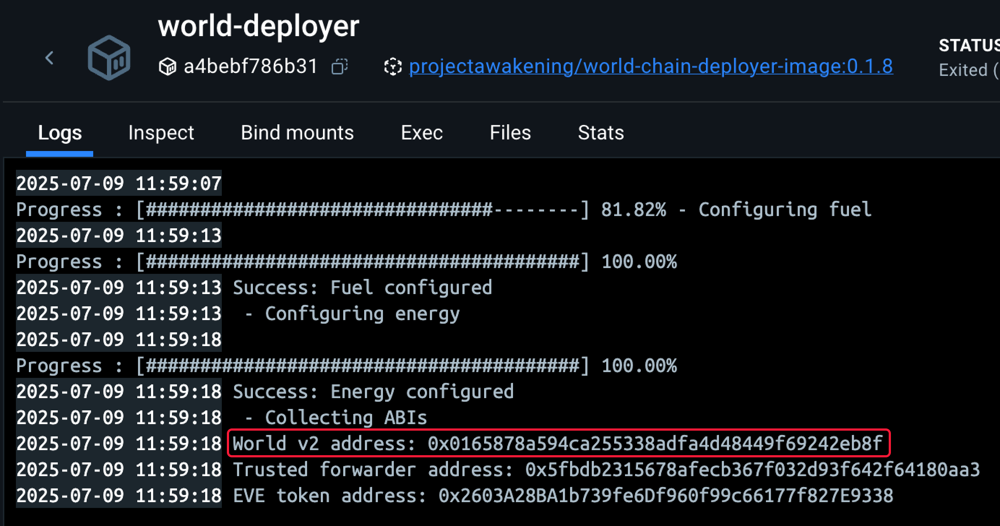
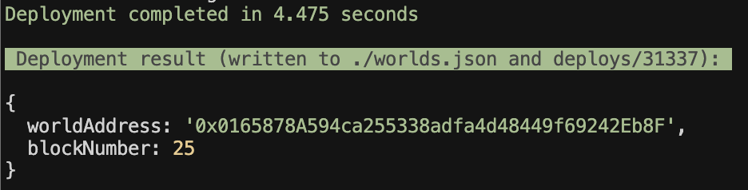

# Smart Turret Example

## Introduction
This guide will walk you through the process of building contracts for the smart turret, deploying them into an existing world running in Docker, and testing their functionality by executing scripts.

This example shows how to interact with the Smart Turret smart assembly and how to create contracts for it. The Smart Turret allows you to defend an area and can be configured to determine which ships to shoot and the priority to shoot them.

You can use [Deployment and Testing in Local](#Local) to test the example on your computer and [Deployment to Stillness](#Stillness) to deploy it to the game.

### Additional Information

For additional information on the Smart Turret you can visit: [https://docs.evefrontier.com/SmartAssemblies/SmartTurret](https://docs.evefrontier.com/SmartAssemblies/SmartTurret)

### Example Behavior Explanation

This example alters the Smart Turret to have two specific behaviors:

1. It does not shoot at anyone in the specified corporation.
   
2. It prioritizes shooting ships that have the lowest percentage of health. This is done as a strategy, as it means that ships can be destroyed faster. A byproduct of this, is that groups of Smart Turrets will share targets if in range when several are used with this example.  

The game calls the inProximity function, and gets the received target array. It then picks it targets in reverse order. Meaning, it will pick the target at the end of the array. Currently the weight value is not used in-game, however is used by the sorting function.

## Deployment and Testing in Local<a id='Local'></a>
### Step 0: Deploy the example contracts to the existing world
First, copy the World Contract Address from the Docker logs obtained in the previous step, then run the following commands:



Move to the example directory with:

```bash
cd smart-turret
```

Then install the Solidity dependencies for the contracts:
```bash
pnpm install
```

This will deploy the contracts to a forked version of your local world for testing.
```bash
pnpm dev
```

Once the contracts have been deployed you should see the below message. When changing the contracts it will automatically re-deploy them.



### Step 1: Mock data for the existing world **(Local Development Only)**
Click on the "shell" process and then click on the main terminal window. 

To generate mock data for testing the Smart Turret logic on the local world, you can click on the shell process as seen in the image below, click in the terminal and then run:


```bash
pnpm mock-data
```

This will create the on-chain turret, fuel it, bring it online, and create a test smart character.

### Step 2: Configure Smart Turret
To set the smart turret ID, and allowed corporation ID use:

```bash
pnpm configure
```

You can adjust the values of the Smart Turret ID and allowed corp ID in the .env file as needed, though they are optional.

### Step 3: Test The Smart Turret (Optional)
To test the Smart Turret In Proximity functionality you can use the follow command:

```bash
pnpm execute
```

## Deployment to Stillness<a id='Stillness'></a>
### Step 0: Deploy the example contracts to Stillness
Move to the example directory with:

```bash
cd smart-turret/packages/contracts
```

Then install the Solidity dependencies for the contracts:
```bash
pnpm install
```

Next, convert the [.env](./packages/contracts/.env) **WORLD_ADDRESS** and **RPC_URL** value to point to Stillness using: 

```bash
pnpm env-stillness
```

Change the namespace from test to your own custom namespace. This will be the namespace that you use for future development with the Item Seller or other smart contracts. For example, you could use your username as the namespace. Once you deploy to a namespace, it will set you as the owner and only you will be able to deploy smart contracts within the namespace. Namespaces can only contain a-z, A-Z, 0-9 and _.

Use this command and then input your new namespace to change it:

```bash
pnpm set-namespace
```

Now set the private key. Get your recovery phrase from the game wallet, import into EVE Wallet and then retrieve the private key as visible in the image below.


```bash
pnpm set-key
```

Then deploy the contract using:

```bash
pnpm run deploy:pyrope
```

Once the deployment is successful, you'll see a screen similar to the one below. This process deploys the Smart Turret contract. 


### Step 1: Setup the environment variables 
Next, set the environment variables using the below command.

```bash
pnpm set-config
```

Use the below steps for getting the values to input into the set-config tool

For Stillness, the smart turret id is available once you have deployed an Smart Turret in the game. Right click your Smart Turret, click Interact and open the dapp window and copy the smart turret id.

You then need to set the allowed corp ID to your corporation ID. You can find this through:

1. Search for your smart character by searching your name in https://blockchain-gateway-stillness.live.tech.evefrontier.com/smartcharacters
   
2. Use https://blockchain-gateway-stillness.live.tech.evefrontier.com/smartcharacters/CHARACTER_ADDRESS and replace **CHARACTER_ADDRESS** with the character address from the previous step
   
3. Retrieve the corpId from the retrieved JSON

### Step 2: Configure Smart Turret
To configure which Smart Turret the contract uses and the allowed corporation, run:

```bash
pnpm configure
```

You can alter the smart turret ID and allowed corporation ID in the .env file or using the config command as needed.

### Troubleshooting

If you encounter any issues, refer to the troubleshooting tips below:

1. **World Address Mismatch**: Double-check that the `WORLD_ADDRESS` is correctly updated in the `contracts/.env` file. Make sure you are deploying contracts to the correct world.
   
2. **Anvil Instance Conflicts**: Ensure there is only one running instance of Anvil. The active instance should be initiated via the `docker compose up -d` command. Multiple instances of Anvil may cause unexpected behavior or deployment errors.

3. **Turret ID Mismatch (Devnet)**: Double-check that the `SMART_TURRET_ID` is correctly updated in the `contracts/.env` file. 

### Still having issues?
If you are still having issues, then visit [the documentation website](https://docs.evefrontier.com/Troubleshooting) for more general troubleshooting tips.